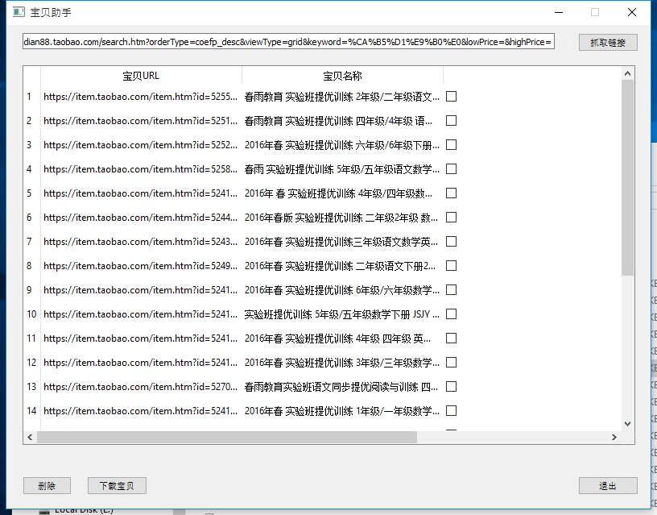
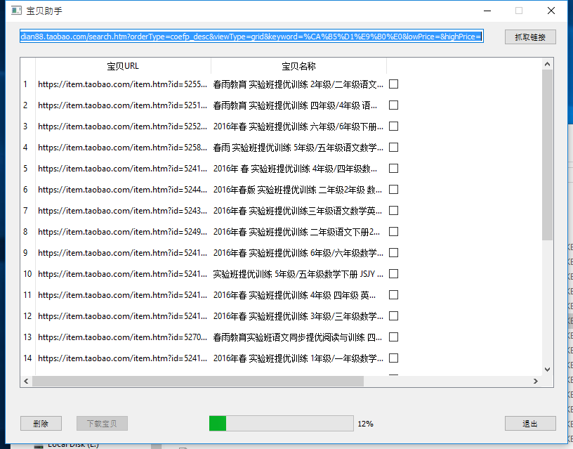
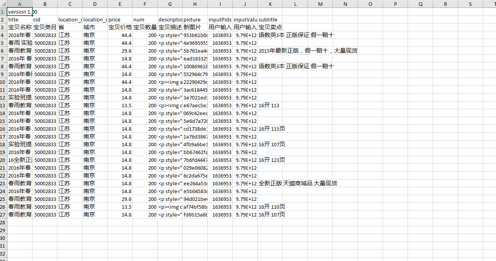

# Tequlia
* Language & Tool
  1. Python 2.7
  2. Pyinstaller (for export)
  3. QtDesigner (for UI design)
* Paltform
  * Windows (32/64 compatiable)
* Introduction
  1. Tequlia is a web crawler, which is designed for batch crawling item information from [Taobao website](https://www.taobao.com/)  including metadata and descriptions (pictures) (currently only support book category).
     
  2. This tool targets at people who sells items on Taobao website. With this tool, people no longer need to upload item which is similar to other sellers. All they need to do is make a few of modifications after crawlering.
* Usage
  1. Use pyinstaller to export .exe program. You will find the .exe file in /dist directory.
  2. The program finally output file in CSV format, which is supported by [Taobao Assistance](http://zhuli.taobao.com/) (A tool provided by Ali for sellers to upload items)